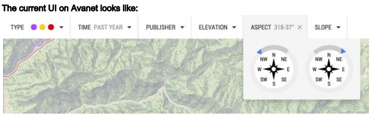
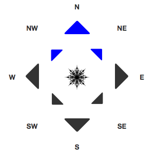
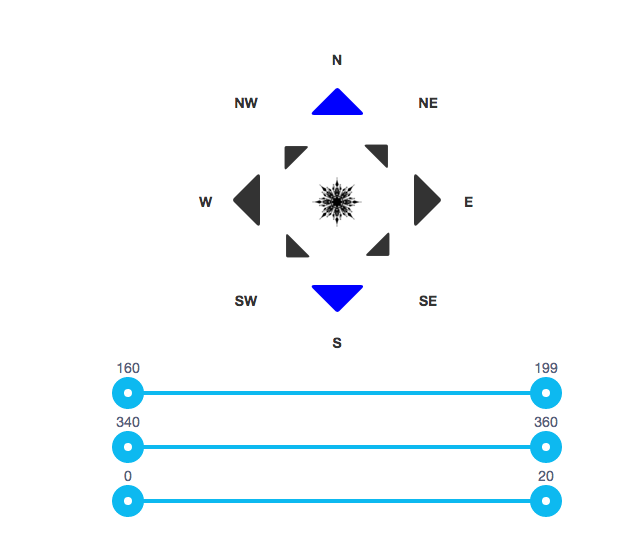
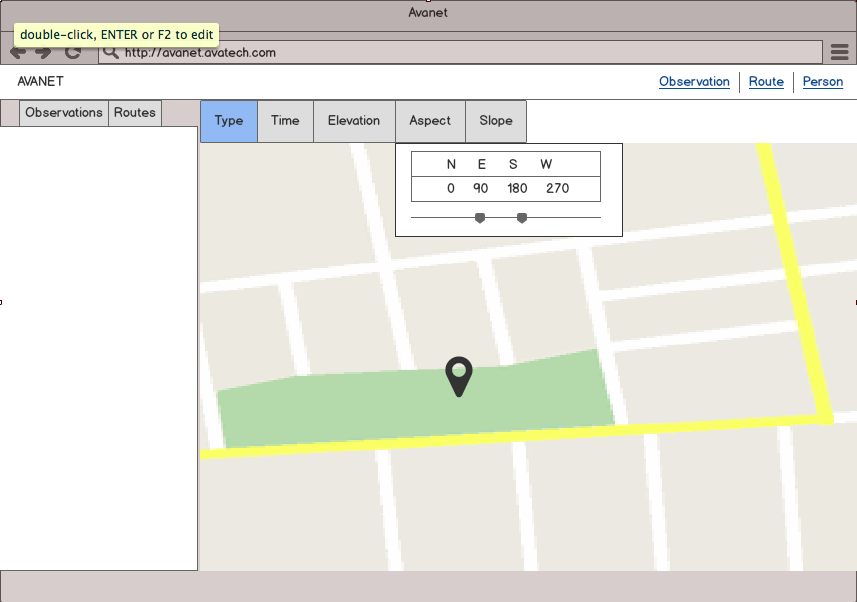
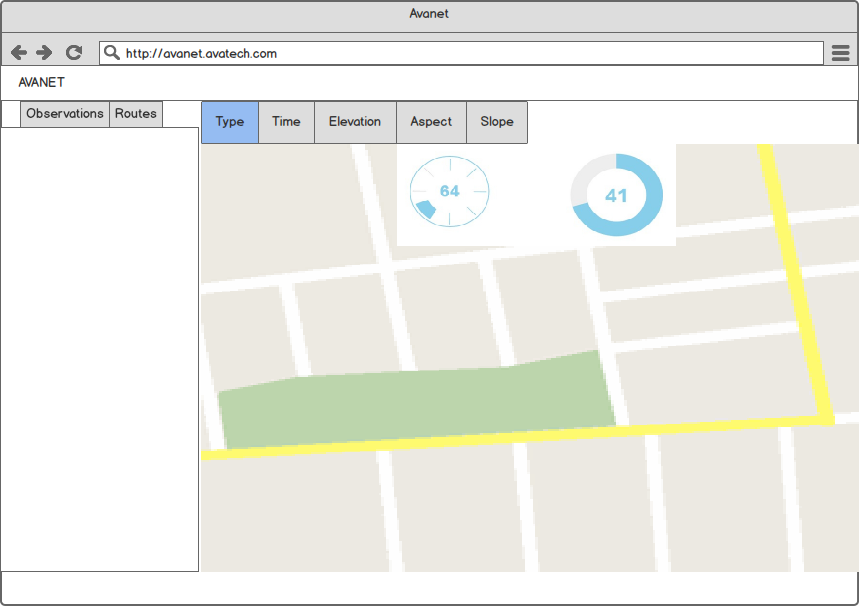
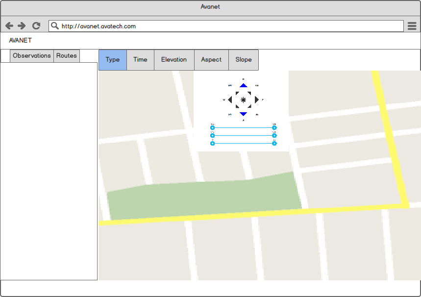
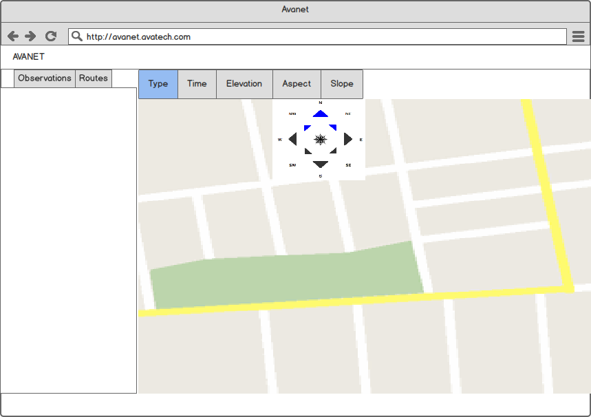

# Avanet Feature Proposal

Project Dependencies & Instructions:

- Command Shift J : open the console to see the array of filtered degrees update.  

- If you want to use the slider. Use a Bower Install
```
bower install --save angularjs-slider
```

- All other features are available via CDN.

- Run a static server from /avanet


## Problem:
 * The current UI is functional, but far from elegant or intuitive.
 * It needs to be redesigned and implemented. The main functionality can be described as:

```
 As a user, I want to only see observations between a N​orth West ​and N​orth East​ aspect.
 ```

The Current UI



## Approach:
* Understand the minimalist design approach, and view it within the context of the surrounding features.
* Understand the problem.
    * Elegance: as a developer, elegance is less of a "gimmick", like a rotating image or dial from a library, and more likely to embrace a clean and simple UI.
    * Intuitive: as a user, I currently have to pick a minimum aspect and a maximum aspect, and then scroll to narrow the degree range.  As a backcountry enthusiast, when looking up observations I rarely care about the actual degree and focus more on the actual bearing.  While a degree may be a part of the observation, at this stage, I am not sure I care about degrees ( though that data is precious on the backend ).
* Problem with current UI:
  * Duplication: There are two compasses, and on a personal level, I don't mind that, as a developer anytime I see something twice, I have to question it.
  * Limited Search: Currently, you can filter the observations by bearing, but ONLY BETWEEN TWO POINTS. You CANNOT  choose to look at both South and North alone, without also observing 180 degrees of obs.


## Challenges:

1. Time: 24 hours looks more like one long work day.  Understanding the problem is simple, however as a developer you often are either given designs, have developed them with your team, or make small judgement calls.  Here, it was crucial to narrow the scope of the problem and implement a simple enough design feature that could be done properly in that time frame. There are 100 ways to go about this, but at the end of the day, if there is a deadline, push a feature.  

2. Design: While I believe I have an eye for UI design, my personal opinions matter less in the scope of a business, and I need to serve the needs of the context. For example, one could use and Jquery Knob or Dial import for a visual, but the functionality would be the same as it is currently.  Using an actual compass image with 3d CSS transforms would ultimately be the same.  Given more time, I may style the fonts and use arrows that have a harder edge.

3. Functionality:  This was a fun problem!  There a number of ways to approach this: like drawing a custom compass or charting mechanism in Canvas, using cardinal directions only, 3d globe On Drag implementation, selection buttons, lists of draggable ranges, etc.  
  * Canvas would take significantly longer to get "right" and would be very similar;
  * Ranges only, would be less intuitive and clean.
  * We are using Angular, not Jquery, so the complexity of charting and interaction increases, slightly.
  * 2 inputs: The prompt asks for 2 inputs to see 3 aspects.  I gave this serious consideration.  I ultimately decided that though my implementation took 3 clicks to get the same result...it was a small sacrifice that was worth making, for now.
  * As a result of the discovery period and approach issues, less code was written.

## Decision:
* The hardest functionality decision I made, was to rule out a draggable compass, and ultimately to force users into making less decisions.  I.e. Pick the aspects you want outright.  But, this also allows for multiple selections without including 180 degrees, for example.
* UI:  I decided simplicity and intuitiveness ruled all. Click your aspect, and it filters your results.  In this contrived example, I am showing the degrees you filter by in the console.  Each selection pushes those corresponding degree ranges into an array, which can then be either pushed to or cross referenced with the server.




## Stretch Goal / Additional Functionality in the Future:
If filtering by degree is an important feature:

* I made it to a point where I implemented range sliders that corresponded to each bearing, and were toggled OnClick.  Doing so drops the range slider below the mock compass, and would ultimately allow users to filter by degree.

* I will leave what I had in the code-base and commented out. Though it does not actually filter yet, if you would like to see it, just uncomment.




## Wireframes

1.)



2.)




3.)



4.)




## Wrap-Up

Site Issues and Comments:
* On the faqs tab under ordering, the footer is not fixed to the bottom of the page as it is throughout the rest of the site. easy fix.
* There are also several instances of errors in the console due to tiles or resources not loading properly. I'm not sure where they are coming from, but it may just be an angular issue/ quirk.
* Feature Proposal:
  * Subscriptions:  As a user, I can subscribe to a location, like my hometown and surrounding areas. For example, if I register my home as Crested Butte, when I log in, I am immediate taken to CB on the map, and can view a list of the most recent observations.
  * Feed: It may be nice in the future as observations increase to have access to a feed or list of tiles showing observations off the map. As a user, I can read through recent observations without having to pin point them by location.
    *  Perhaps another dash?
    *   Social media integration?
  * STRETCH:  there are numerous radio feeds being broadcast with avalanche conditions every day. I wonder if they provide RSS feeds that can be brought in to you User home page, or integration to listen via your dash.


Overall: I love what is available thus far, awesome job.

I just wanted to say that this was a fun problem! I have never built a compass, and given more time I'm sure I could have made a more feature rich tool.  There are dozens of small problems inherent in a compass, all interesting, all unique, and especially as you move into a canvas version... increasingly difficult.  


Thanks!
